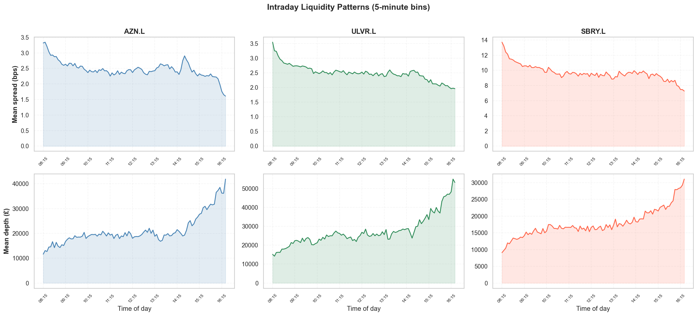
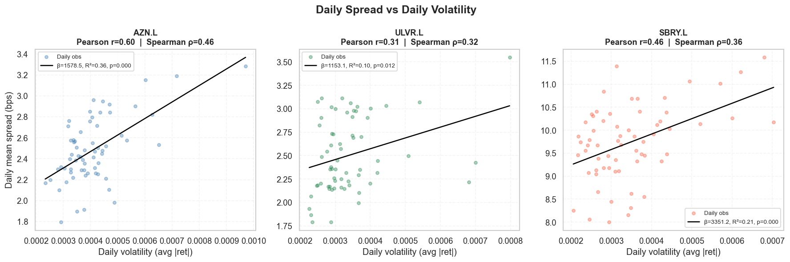
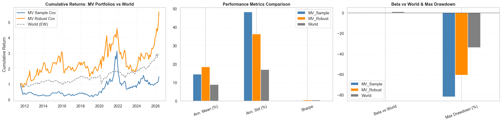

# Intraday Liquidity and Portfolio Construction

  

Two connected studies from a portfolio-manager's perspective, on UK equity microstructure and
country-level allocation.

## Part 1 — Intraday liquidity (LSE, 1-minute data)

Quoted spreads and depth for AstraZeneca, Unilever and Sainsbury across ~31,000 one-minute
observations per name over three months:

- Large caps quote ~2.5 bps; the mid-cap (SBRY) ~9.7 bps with the widest open (>13 bps).
- Spreads are widest at the open and **do not** widen into the close — depth *triples* into the
  close (ULVR: ~GBP 15k at 08:15 to >GBP 50k near 16:25), contrary to the textbook U-shape.
- Spread-volatility regressions: positive and significant for all three names (AZN R^2 = 0.36);
  depth-volatility significantly negative for AZN/SBRY — liquidity deteriorates on both margins
  exactly when repositioning is most urgent.
- Execution implications: delay non-urgent trades 30-60 minutes after the open; block trades
  target the close.

*Spreads compress after the open; depth builds all day and triples into the close — no textbook U-shape.*

## Part 2 — Country allocation (34 markets, 2006-2026)

- Cross-country momentum HML earned ~0 (Sharpe 0.005) over the sample — momentum-crash dynamics;
  winners are nonetheless structurally lower-beta, so the signal still carries risk information.
- Mean-variance with a raw 60-month sample covariance on 34 assets is error maximisation in
  action: Sharpe 0.30, -82% max drawdown.
- Replacing pairwise correlations with the cross-sectional average (constant-correlation
  estimator, Ledoit-Wolf target) improves **every** metric simultaneously: Sharpe 0.51,
  mean 18.5% vs 8.9% world, beta 0.15 — a near-market-neutral overlay.

*Sample vs constant-correlation covariance: the robust estimator improves every metric simultaneously.*

## Data

The 1-minute LSE panel is course-provided and not redistributable; the notebook expects
`data/trading_data.csv` with columns [Stock, Date and time, bid, ask, bid size, ask size].
Monthly country total-return indices are standard vendor data (34 developed + EM markets).

## Attribution

Group project at Bayes Business School with Cristina Becali, Sebastien Van der Heyden and
Rodrigo Lopez Soler. Repository restructuring and documentation are mine.
